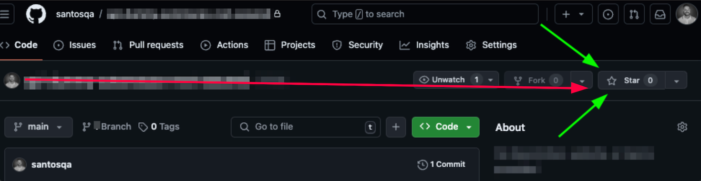

<p align="center">
  <a href="https://santosqa.github.io/" target="_blank" rel="noopener noreferrer">
    <picture>
      <source media="(prefers-color-scheme: dark)"  srcset="./assets/cypress-logo-dark.png">
      <source media="(prefers-color-scheme: light)" srcset="./assets/cypress-logo-light.png">
      
    </picture>
  </a>
</p>

---

> 💡 **Dica**: Use Ctrl+Click (Windows/Linux) ou Cmd+Click (Mac) para abrir os links em uma nova aba.

[](https://santosqa.github.io) [](https://github.com/santosqa) [](https://www.linkedin.com/in/santosqa) [](https://www.instagram.com/santosqa_/) [](https://www.santosqa.com) [](https://www.apartamentovistamar.com/) [](https://santosqa.github.io/receitas/) [](https://santosqa.github.io/santos-locais-turisticos/)


---


# 💻 Cypress Express Web API

Conheça a Trilha de Cypress na Udemy e aprenda a criar testes automatizados para WEB e API com Cypress!

👉🏼  https://itau.udemy.com/learning-paths/9480633/

O Cypress é uma ferramenta moderna de automação de testes. 

Com Cypress, é possível realizar testes end-to-end de forma eficiente e simples, validando o comportamento da aplicação de ponta a ponta, com foco na interação com os elementos presentes na maioria das páginas web e api. Além disso, a ferramenta fornece uma série de recursos como captura de telas, gravação de vídeos, depuração em tempo real e relatórios de testes, tornando o processo de automação e validação mais acessível.

## Benefícios do Cypress:
  **Desempenho Rápido:** Execução instantânea de testes, sem a necessidade de esperar por longos tempos de execução.
  **Depuração Simples:** Ferramentas de depuração e exibição de comandos diretamente no navegador.
  **Testes em Tempo Real:** Visualização do comportamento da aplicação enquanto os testes estão sendo executados.
  **Facilidade de Uso:** Sintaxe simples e APIs intuitivas para escrever testes, ideal para iniciantes e especialistas.
  **Documentação Extensa:** A documentação oficial oferece exemplos e guias para facilitar o aprendizado.

<div style="background-color: #ffd9c9; padding: 10px; border-radius: 5px;" role="alert" aria-live="assertive">
  <strong>⚠️ Atenção!</strong><br>
  <p>As URLs e credenciais usadas neste projeto são de propriedade exclusiva de pessoas matriculadas nos cursos contido na Trilha de Cypress da Udemy. <em>Não utilize-as sem autorização.</em></p>
</div></br>

[](https://www.santosqa.com/top/) 

<div style="background-color: #DDA0DD; padding: 10px; border-radius: 5px;" role="note" aria-live="polite">
  <p>💡 Este repositório é o seu ponto de partida para automatizar testes em diferentes camadas com Cypress. Crie scripts poderosos, escaláveis e prontos para dominar qualquer aplicação! 🚀💻</p>
  <p>⚡ Comece sua jornada de automação e leve seus testes para o próximo nível. O futuro dos testes está em suas mãos. Vamos juntos nesse desafio! 💪</p>
</div>


---
## ⭐️ Deixe uma estrela para apoiar o projeto 👍🏽

<p align="center">
  
</p>


----------------------

## Links Úteis
  
  - yarn: https://yarnpkg.com/
  - package cypress yarn: https://yarnpkg.com/package?q=cypress&name=cypress
  - github cypress: https://github.com/cypress-io/cypress
  - FakerJs (simulador de dados): https://fakerjs.dev/
  - Viewport: https://docs.cypress.io/api/commands/viewport
  - Hooks BeforeEach: https://docs.cypress.io/guides/core-concepts/writing-and-organizing-tests#Hooks

---
## Extensões VsCode
[](https://marketplace.visualstudio.com/items?itemName=tal7aouy.rainbow-bracket) [](https://marketplace.visualstudio.com/items?itemName=dracula-theme.theme-dracula) [](https://marketplace.visualstudio.com/items?itemName=esbenp.prettier-vscode) [](https://marketplace.visualstudio.com/items?itemName=AtomMaterial.a-file-icon-vscode) [](https://marketplace.visualstudio.com/items?itemName=shd101wyy.markdown-preview-enhanced) [](https://marketplace.visualstudio.com/items?itemName=MS-CEINTL.vscode-language-pack-pt-BR) [](https://github.com/tonsky/FiraCode)

####
----------------------

## Clonar o projeto

- Clone projeto usando o comando: 
```bash
git clone https://github.com/santosqa/cypress-api.git
```
- Na pasta raiz do projeto, execute o comando para remover o versionamento: 
```bash 
rm -rf .git 
```

##### Comandos Adicionais para o Git:

- Iniciar um novo repositorio Git: 
```bash 
git init
```
- Criar e mudar para uma nova branch: 
```bash 
git checkout -b nome_da_branch_desejada
```
- Mudar para uma branch existente: 
```bash 
git checkout nome_da_branch_desejada
```
----------------------

## Ambiente

##### 1. crie o conta no CloudAMQP: 
- 1 - Site: https://www.cloudamqp.com/
- 2 - Crie uma nova instância
- 3 - crie um arquivo com a extensão ```.env``` na raiz da pasta API contendo o cód abaixo e inclua a sua string de conexão do RabbitMQ.
  ```bash 
  MONGO_URI=<sua istring de conexão do mongoDB>
  AMQP_URL=<sua string de conexão com o RabbitMQ>
  QUEUE_NAME=tasks
  ```
- 4 - Crie um arquivo com a extensão ```.env``` na raiz da pasta mail contendo o cód abaixo e inclua a sua string de conexão do RabbitMQ.
  ```bash 
  AMQP_URL=<sua string de conexão com o RabbitMQ>
  QUEUE=tasks
  ```
##
##### 2. crie o conta no cloud.mongodb:
- 1 - Site: https://cloud.mongodb.com/
- 2 - Crie um novo cluster
- 3 - No arquivo com a extensão ```.env``` na raiz da pasta API, adicione a sua string de conexão do MongoDB.
  ```bash 
  MONGO_URI=<sua istring de conexão do mongoDB>
  AMQP_URL=<sua string de conexão com o RabbitMQ>
  QUEUE_NAME=tasks
  ```
##
##### 3. Crie a conta no Ethereal:
- 1 - Site: https://ethereal.email/
- 2 - Pegue o trecho de cod fornecido como no exemplo abaixo e cole no arquivo app.js na pasta mail:
```const transporter = nodemailer.createTransport({
    host: 'smtp.ethereal.email',
    port: xxx,
    auth: {
        user: 'xxxx.xxxxxx@ethereal.email',
        pass: 'xxxhGeXGwM4XcTx7zF'
    }
});
```
###
##### 4. Usando o terminal no diretório da pasta MAIL, execute os comandos abaixo:
- 1 - Instale as dependencias | ``` npm install``` 
- 2 - Inicie a api | ```npm run dev``` 
###
##### 5. Usando o terminal no diretório da pasta API, execute os comandos abaixo:
- 1 - Instale o nvm | ```nvm install --lts``` 
- 2 - Setar o uso do nvm | ```nvm use --lts``` 
- 3 - Instale as dependencias | ``` npm install``` 
- 4 - Inicie a api | ```npm run dev``` 
- 5 - Url da aplicação | localhost:3333/ 

###
##### 6. Usando o terminal no diretório da pasta WEB, execute os comandos abaixo:
- 1 - Instale as dependencias | ```npm install``` 
- 2 - Inicie a Aplicação WEb |  ```npm run dev```  Ou execute em mode de depuração com: ```node --inspect server.js```
- 3 - Url da aplicação | localhost:3000/ 
- 4 - Verificar a porta no Linux/Mac |```lsof -i :3000```  
- 5 - Finalizar o processo no Linux/Mac|```kill -9 <PID>`` 
- 6 - Verificar a porta no Windows |```netstat -ano | findstr :3000```  
- 7 - Finalizar o processo no Windows |```taskkill /PID <PID> /F`` 


###
##### 7. Usando o terminal no diretório da pasta TEST, execute os comandos abaixo:
- 1 - Iniciar o projeto | ```npm init``` 
- 2 - Instalar cypress | ``` npm i cypress@12.12.0 -D ``` 
- 3 - Abrir cypress | ```cypress open```
- 4 - Instalar mongoDB como dependencia de desenvolvimento | ```npm i -D mongodb```
- 5 - Instalar o plugin Cypress API | ```npm i cypress-plugin-api -D```
- 6 - fazer o import do plunig no arquivo `e2e.js` | ```import 'cypress-plugin-api'```

#

---

> 🔥  Dica 1  
> No Arquivo .gitignored, o padrão `**/` significa "em qualquer nível de diretório". Isso garante que os diretórios e arquivos sejam ignorados em qualquer lugar do projeto, não apenas na raiz. Exemplo:  `**/node_modules/`  em qualquer lugar do projeto que existir a pasta node_modules, será ignorado ao enviar para o repositório remoto.


> 🔥  Dica 2  
> Em sua página de testes `seuTest.cy.js` inicie sempre com a anotação `/// <reference types="cypress" />` para que seja habilitado o uso do IntelliSense. Isso ajudará você a escrever testes de forma mais eficiente, com sugestões de código e autocompletar.

---


---
## 🌎 Sobre o autor
🐞 Caçador de bugs, guardião da qualidade e parceiro do time: antecipo problemas e reforço a qualidade reduzindo dor de cabeça em produção.

Projeto mantido por **Ricardo Santos** — QA Engineer

Focado em:
* Qualidade de software
* Automação de testes
* Testes Web, API e Mobile
* Observabilidade
* Engenharia de qualidade

🌐 [santosqa.github.io](https://santosqa.github.io)👋🏼


---


[](https://santosqa.github.io) [](https://github.com/santosqa) [](https://www.linkedin.com/in/santosqa) [](https://www.instagram.com/santosqa_/) [](https://www.santosqa.com) [](https://www.apartamentovistamar.com/) [](https://santosqa.github.io/receitas/) [](https://santosqa.github.io/santos-locais-turisticos/)

##
